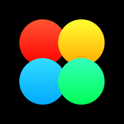

# EmotionTracker

# 📖 About
An application to track your well-being throughout the day

## 👨‍💻 iOS Deployment Target: 17.6

## 💻 Tech Stack
- Swift
- UIKit
- Coordinator
- SnapKit

## 📱 Screenshots

<h3 align="center">Welcome Screen</h3>

    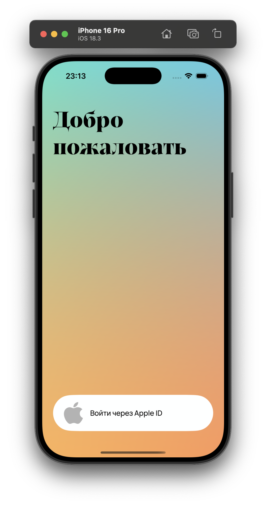

<h3 align="center">Log Screen</h3>

    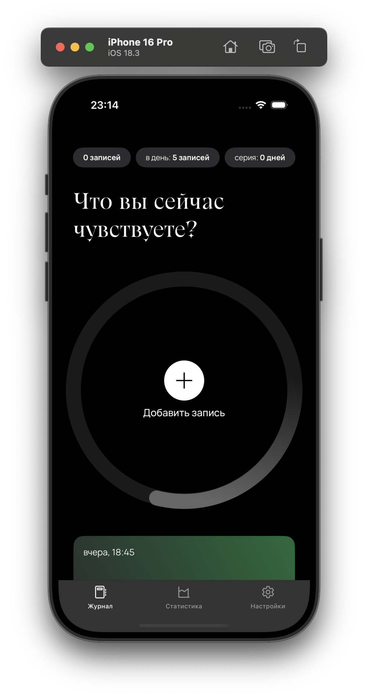
    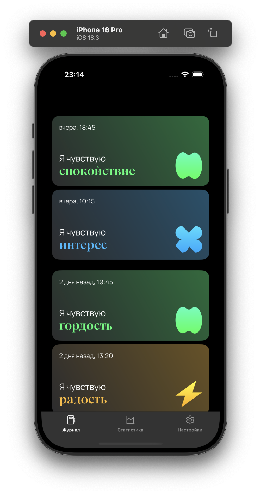
    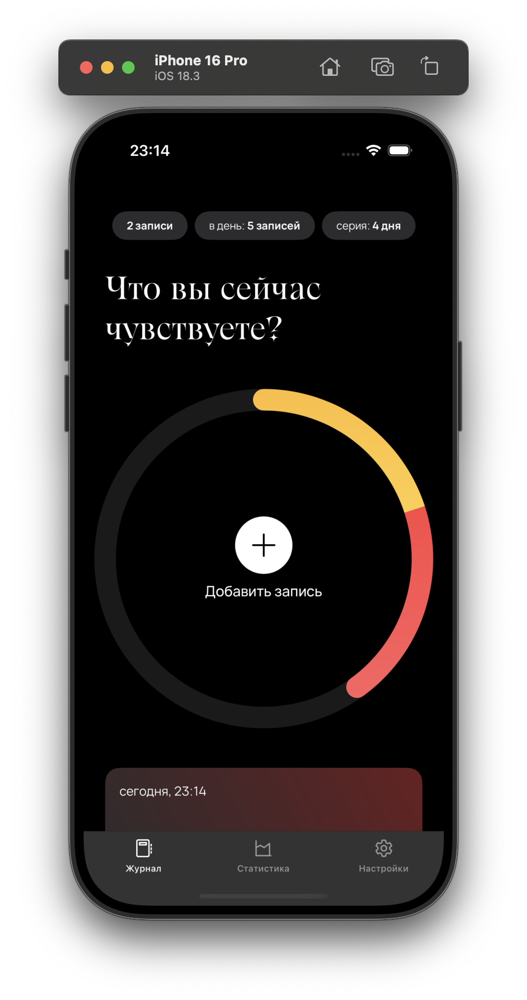

<h3 align="center">Add Note & Edit Note Screens</h3>

    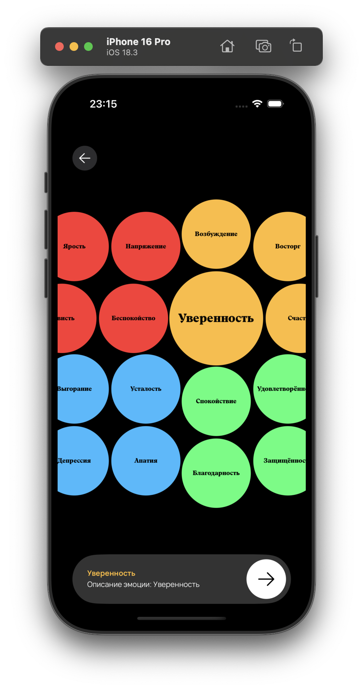
    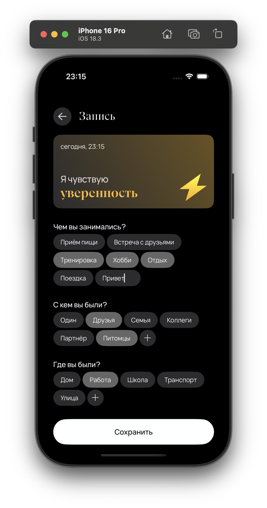

<h3 align="center">Statistics Screen</h3>

    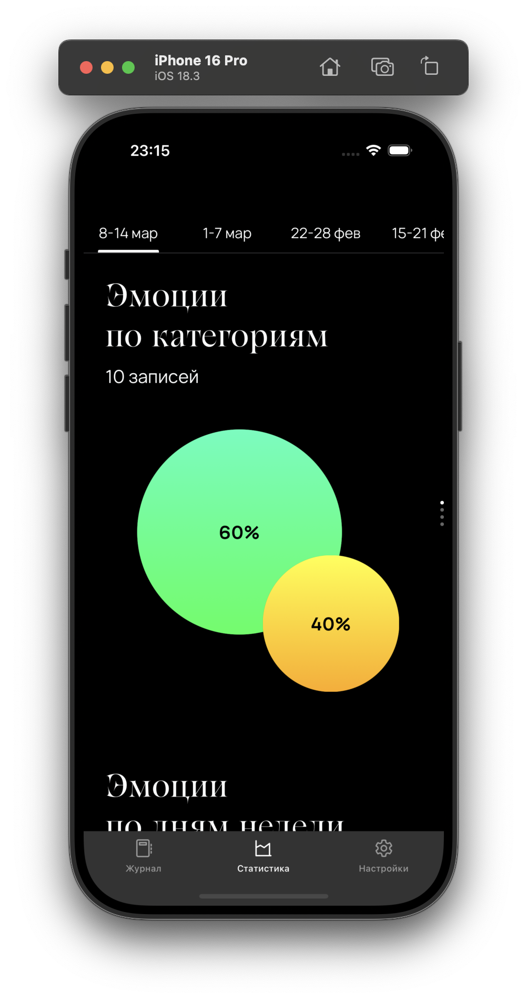
    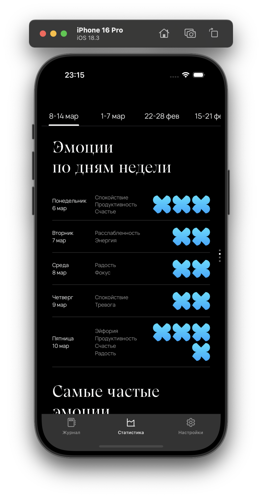
    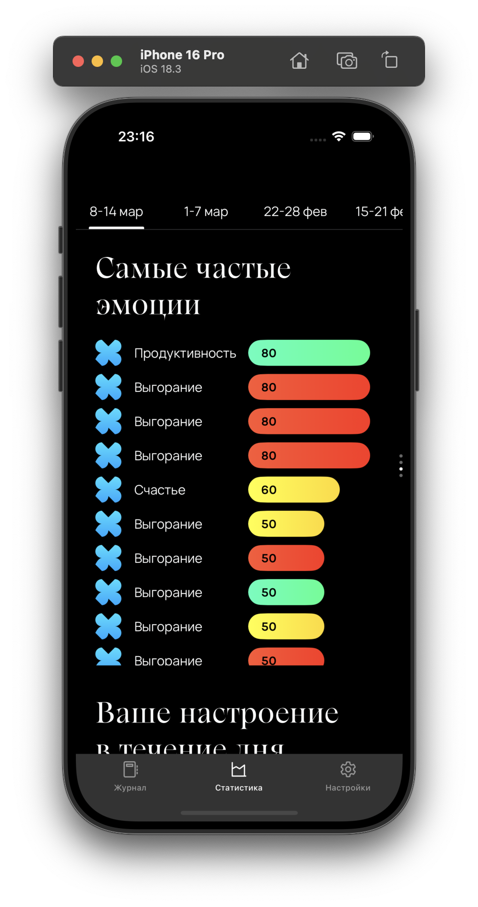
    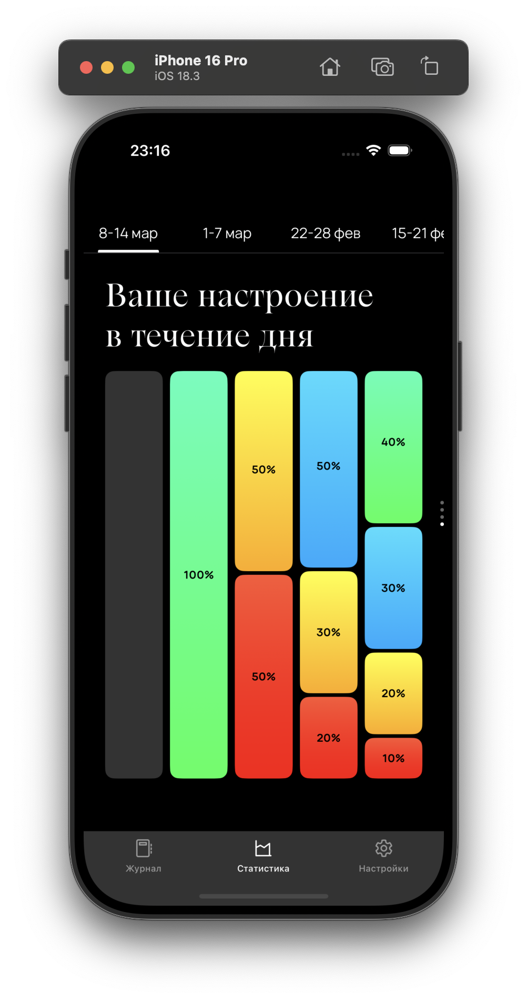

<h3 align="center">Settings Screen</h3>

    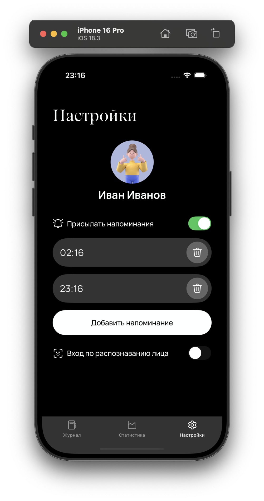

